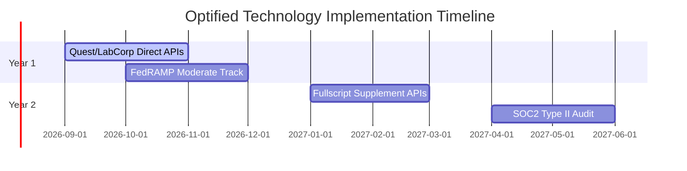

# Optified Platform: Technology & Development Roadmap
*Chronicles of Completed Phases & Add-On Feature Targets*

---

## 1. Past Milestones (Phases 1-300)
* **Core Foundation:** Go standard library core, HTMX + Alpine dynamic frontends, PostgreSQL managed schema definitions, and secure cookie session overrides.
* **Biomarkers Parsing Engine:** Genova Diagnostics, Microbiomix, and PNOĒ lab PDF parsers converting text columns into indexed SQL records.
* **Audit Trails & Security Gates:** HMAC-SHA256 digital signatures for clinician clinical observations. Ingress webhooks with signed timestamp headers and a 5-minute leeway window.

---

## 2. Recent Milestones (Phases 301-515)
* **Epigenetic Biological Age & DunedinPACE:** Implemented epigenetic clock simulations and DunedinPACE rate changes comparison log histories.
* **Gut Microbiome Diversity:** Built Shannon diversity index advice print target verification and resets logs queries.
* **Cardio Alerts & HRV:** Enforced training session Zone 1 warnings alerts log searches and yearly HRV sleep correlation trend line hover logs.
* **Infrastructure Security:** Aligned architecture to the **FedRAMP Moderate Baseline (NIST SP 800-53 Rev 5)**, featuring:
  - Private GKE Autopilot clusters, Cloud Armor WAF protection, and Customer-Managed KMS Keys (CMEK).
  - Cloud Logging sinks streaming in real-time to external SIEM platforms (Chronicle/Splunk).
  - GKE Workload Identity, seccomp RuntimeDefault, and read-only container root filesystems.

---

## 3. Next Milestones (Q4 2026 - Q2 2027)

### 3.1 Q4 2026: Quest & LabCorp Direct API Bridges
* **Objective:** Direct API integrations to fetch patient diagnostic results, eliminating PDF uploads.
* **Security:** Secure HL7/FHIR compliance bridges and OAuth2 key rotations.

### 3.2 Q4 2026: FedRAMP Moderate Track
* **Objective:** Finalize C3PAO meeting, submit System Security Plan (SSP), and obtain FedRAMP Moderate Authorization.

### 3.3 Q1 2027: Automated Pharmacy Dropshipping APIs
* **Objective:** Connect clinician protocols to Thorne and Fullscript APIs, enabling automated dropship delivery.

### 3.4 Q2 2027: SOC2 Type II Audit & Certification
* **Objective:** Establish formal security processes and run quarterly penetration tests.
