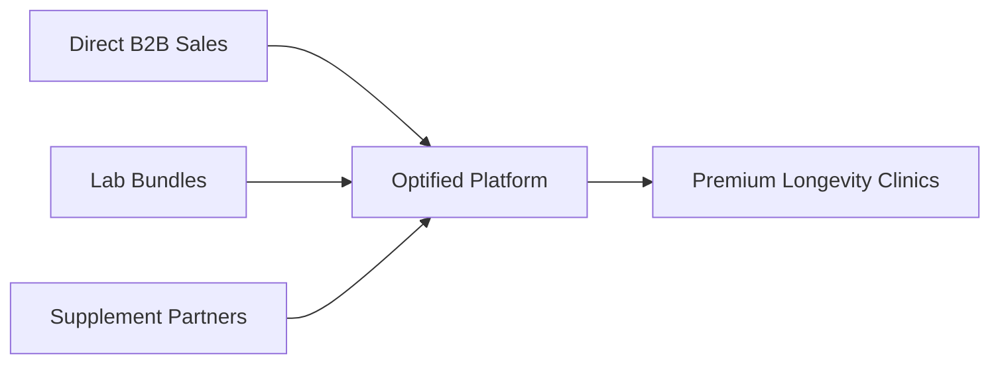

# Optified Platform: Go-To-Market Plan
*High-Affluence Channels & Clinical Integrations*

---

## 1. Target Audience Segmentation

Optified focuses on high-margin segments in private healthcare and performance optimization, prioritizing cash-paying clinic models over insurance-based clinics.

### 1.1 Target Segments
1. **Primary Segment: Premium Longevity & Anti-Aging Centers**
   * *Profile:* Anti-aging clinics, functional medicine practices, and cellular therapy centers.
   * *Locations:* Wealthy metro hubs (San Francisco, New York, London, Zurich, Munich, Tokyo).
   * *Pricing model:* Cash-based concierge models (average patient spend: $10,000 to $50,000 annually).
   * *Need:* A centralized clinical platform to integrate complex biomarker profiles and save clinician time.
2. **Secondary Segment: Elite Sports Performance & Corporate Concierge Practices**
   * *Profile:* Sports nutritionists, functional coaches, and executive wellness teams.
   * *Need:* Real-time tracking of biometric wearables, sleep data, and metabolic metrics in a single interface.

---

## 2. Channel & Sales Strategy

To drive adoption, Optified uses a direct B2B sales strategy combined with strategic channel partnerships.

### 2.1 Direct B2B Sales Pipeline
* **Target Outbound Campaigns:** Direct sales outreach targeting clinical directors at premium anti-aging hubs.
* **Demonstration Strategy:** Highlight the platform's time-saving features (e.g. showing how our automated parser ingests blood panel PDFs in seconds).
* **Onboarding Services:** Provide custom data migration services for clinic groups, helping them migrate historical records into Optified.

### 2.2 Laboratory Integration Partnerships (The Trojan Horse)
* **Partner Integrations:** Build API partnerships with major lab diagnostics providers (e.g. Genova Diagnostics, Microbiomix, LabCorp).
* **Bundling Model:** Offer diagnostic laboratories the option to bundle Optified licenses with premium test orders. This enables lab groups to provide clinics with a modern, interactive dashboard instead of a static PDF.

### 2.3 Supplement Dropship Integration (Pharmacy Channel)
* **Partner Integrations:** Partner with compounding pharmacies and supplement distributors (e.g., Fullscript, Thorne Health).
* **Affiliate Revenue:** Integrate prescription and supplement protocols directly into clinician workflows. Optified tracks orders and collects commissions on dropshipped supplements.

---

## 3. Positioning and Pricing Model

* **Market Positioning:** "The Operating System for Longevity Medicine."
* **Standard Tier:** $199/month per clinician seat. Includes core ingestion pipelines, KnowsItAll AI RAG, and clinical notes editor.
* **Concierge Clinic Tier:** $499/month for practices with up to 5 clinician seats. Includes custom clinic branding, custom lab email alerts, and priority GKE cluster hosting.
* **Client Profile Add-on:** $19/month per active client profile. A clinic with 100 active clients generates $2,099/month in total revenue.

---

## 4. Growth Milestones & Goals
* **Year 1 Target:** 200 active clinician seats in the United States and Switzerland. Average monthly revenue per clinic of $1,200.
* **Customer Acquisition Cost (CAC) Goal:** Under $450 in Year 1, dropping to $250 by Year 5 as product-led loops and lab partnerships scale.
