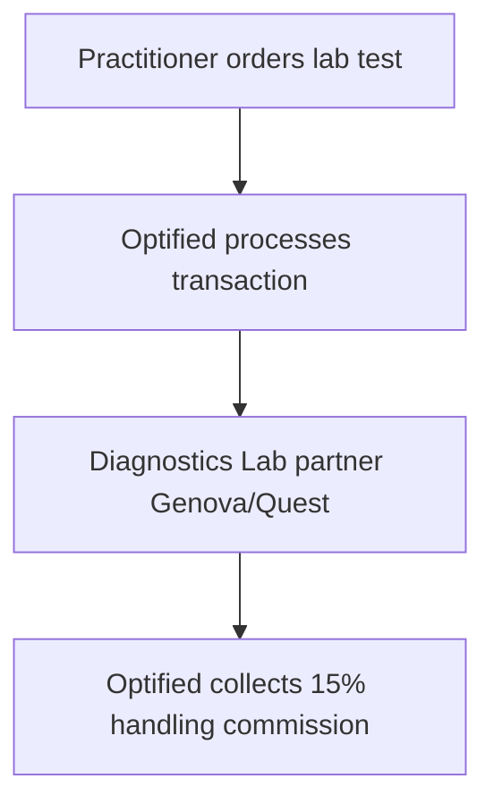

# Optified Platform: Revenue Growth Plan
*Subscription Optimization & Margins Projections*

---

## 1. SaaS Tiers & Subscription Structure

Optified has a high gross-margin business model combining recurring software licenses with transactional partner revenue.

### 1.1 Tiers Breakdown
* **Standard Practitioner Seat:** $199/month per clinician. Includes core uploader queue monitors, RAG PubMed chat assistant, and clinical notes editor.
* **Concierge Clinic Tier:** $499/month (up to 5 practitioner seats). Includes custom branding, custom lab email alerts, and priority GKE hosting.
* **Enterprise Health System Tier:** Custom pricing for systems with 20+ practitioners, offering custom data migrations, dedicated databases, and single-sign-on (SSO) integration.

### 1.2 Patient Portal Licensing
* **Volume Licensing:** $19/month per active client profile. A clinic with 100 active clients yields $2,099/month in total revenue.

---

## 2. Laboratory Affiliate Commissions

* **Commission Model:** Optified collects a 15% handling fee on all diagnostic testing panels ordered through the platform.
* **Diagnostics Partners:** Partnerships with Genova Diagnostics, Microbiomix, LabCorp, and Quest Diagnostics.
* **Value Proposition:** Clinics manage test ordering and results delivery in a single platform, while Optified earns transaction revenue on lab kit sales.

---

## 3. Supplement Dropship & Pharmacy Integration

* **Pharmacy Integrations:** Integrations with partner supplement pharmacies (e.g. Fullscript, Thorne Health) and compounding pharmacies.
* **Dropship Commision:** Clinicians prescribe supplement protocols directly through the patient portal. Optified collects a 20% commission on automated monthly orders.

---

## 4. 5-Year Financial & Margin Projection

Optified expects to maintain a **84% Gross Margin** on recurring software licenses. GKE infrastructure costs scale linearly with the number of active clinics, while AI API costs are managed using local models and prompt engineering.

* **Year 1 Target:** $1.01M Revenue | 200 Clinicians | 2,000 Clients | 19.9% EBITDA Margin
* **Year 3 Target:** $6.88M Revenue | 1,200 Clinicians | 15,000 Clients | 47.7% EBITDA Margin
* **Year 5 Target:** $33.38M Revenue | 5,000 Clinicians | 80,000 Clients | 60.0% EBITDA Margin
