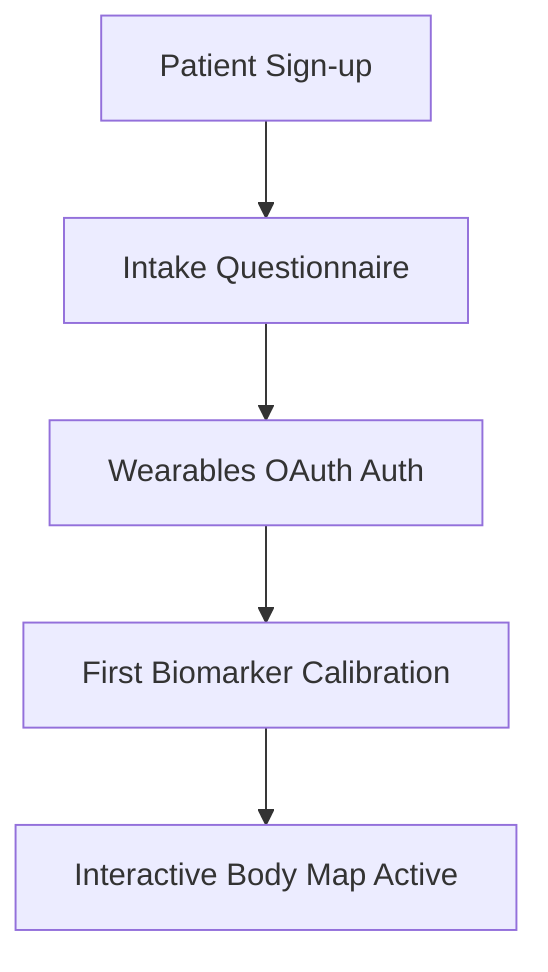

# Optified Platform: User Adoption & Engagement Plan
*Retention Loops and Behavioral Compliance*

---

## 1. Patient Intake & Onboarding Flow

Patient engagement starts with a frictionless onboarding process that immediately demonstrates the value of centralized health tracking.

### 1.1 Step-by-Step Onboarding
1. **Intake Questionnaires:** Collect initial cognitive performance baselines, dietary choices, and historical wellness goals. This data determines initial baseline ranges for anomalous biomarker alerts.
2. **Frictionless Wearables OAuth Authentication:** Secure authentication links for Oura, Whoop, and Apple Health. The system pulls historical sleep data and heart rate variability (HRV) immediately to populate dashboard visualizations.
3. **Anatomical Body Map Activation:** Highlight target organ structures containing anomalous biomarkers. This guides the user to focus on specific protocols (e.g. cardio recommendations for low VO2 max).

---

## 2. Product-Led Growth (PLG) Loops

Optified uses product features to drive viral loops and clinical referral networks.

### 2.1 Clinician-to-Patient Sharing
* **Interactive Export:** Patients can export their wellness reports as a PDF with standard AMA bibliographies in one click.
* **Referral Network:** Shared reports include a link to the clinic's Optified booking portal, enabling patients to refer friends and family.

### 2.2 Interactive Medical Knowledge Graph
* **Interactive Network:** The Alpine-powered SVG Knowledge Graph encourages patients to explore relationships between biomarkers, genetics, and protocols.
* **Literature Grounding:** Tooltips link back to the KnowsItAll AI RAG index, letting patients read peer-reviewed study abstracts (e.g. Autophagy and Longevity) directly.

---

## 3. Compliance and Engagement Boosters

To keep patients engaged, Optified incorporates behavioral incentives that reward consistency.

### 3.1 Supplement Compliance Calendar
* **Visual Compliance:** Interactive 30-day dot calendars displaying daily protocol completion statistics.
* **Positive Feedback Loops:** Color-coded compliance scores based on actual logs. Achieving green targets unlocks achievements linked to the patient's bio-age progression.

### 3.2 Automated Consultation Triggers
* **Anomaly-Driven Bookings:** If wearable telemetry detects an out-of-range metric (e.g., continuous glucose over 250 mg/dL or sleep latency under 3 minutes), the system prompts the patient to book a video consultation.
* **Seamless Bookings:** Patients schedule consultations through an HTMX booking portal, which updates the clinician console and logs the booking to the database.

---

## 4. Telehealth Integration
* **Daily.co Integration:** The dashboard embeds secure, HIPAA-compliant Daily.co video containers.
* **Zero-Friction Access:** Video sessions launch directly in the patient dashboard, eliminating the need to install external apps (e.g. Zoom, Teams).

---

## 5. Analytics & Metrics
Optified tracks patient engagement using privacy-preserving analytics, monitoring:
* **Wearable Sync Frequency:** Ensure data pipelines remain fresh.
* **Protocol Adherence Rate:** Core metric showing patient compliance with clinician recommendations.
* **Monthly Active Users (MAU):** Targeting over 90% retention month-over-month.
