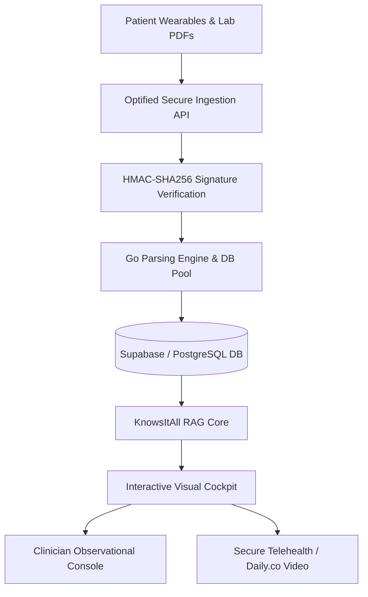

# Optified Platform: Executive Business Plan
*Secure Infrastructure for Multi-Omic Longevity Clinics*

---

## 1. Executive Summary

Optified is the premier enterprise software-as-a-service (SaaS) platform designed specifically for private, high-performance longevity clinics and concierge wellness practitioners. Modern longevity medicine has shifted healthcare from a reactive, disease-focused model to a proactive, bio-marker-driven optimization strategy. However, clinical teams are currently overwhelmed by the manual parsing, integration, and analysis of disparate patient multi-omic datasets—including whole-genome sequencing (WGS), blood chemistry panel PDFs, gut microbiome analyses, and real-time biometric feeds from wearables (Oura, Whoop, Apple Watch).

Optified bridges this critical infrastructure gap. By automating diagnostic PDF ingestion and grounding clinical decisions in an AI-powered Medical Knowledge Graph, the platform reduces clinician administrative overhead by up to 90%. This enables clinic groups to scale from tens to hundreds of active cash-paying clients per clinician, while improving patient adherence to wellness protocols through immersive visualizations and interactive tracking metrics.

---

## 2. Product and Technology Architecture

The Optified Platform leverages a highly efficient, type-safe stack designed for sub-millisecond execution speeds, minimal container footprint, and robust horizontal scaling.

### 2.1 Technology Stack
* **Frontend Cockpit:** Alpine.js for interactive dashboard state rendering combined with HTMX for low-latency HTML page fragment updates. Custom SVGs generate biometric curves, cardiorespiratory output stages, and multi-stage sleep cycle graphs.
* **Backend Core:** High-performance Go application utilizing the standard library, `pgx/v5` for PostgreSQL connection pooling, and the `chi` router for REST API structuring. This enables GKE (Google Kubernetes Engine) container footprints to remain under 50MB.
* **Database Layer:** PostgreSQL (managed via Supabase) utilizing raw database schemas that maintain absolute normalization for genomic variants, biometric records, and client metadata.

### 2.2 Core Product Modules
1. **The Ingestion Queue Monitor:** A real-time processing dashboard that tracks parsed lab PDF uploads (Genova Diagnostics, Microbiomix, Quest Diagnostics) and details parsing statistics, standard deviation alerts (2SD baseline anomalies), and unit conversion logs.
2. **Anatomical Body Map & Tooltips:** An interactive SVG-based visual body map that maps parsed genomic variants (such as *MTHFR* and *ApoE*) and systemic biomarkers directly to target organs (heart, brain, gut), displaying clinical advice in localized tooltips.
3. **KnowsItAll AI Research RAG:** A publication-grounded RAG agent that parses scientific literature databases. Results are filtered by minimum medical journal impact factor and returned with formatted bibliographies to ground clinician protocols.
4. **CGM & Biometric Wearables Dashboard:** Displays dynamic continuous glucose monitoring (CGM) curves, heart rate variability (HRV), VO2 Peak cardio output stages, and Time-in-Range (TIR) metrics.

---

## 3. Regulatory, Security, and Compliance Strategy

Optified enforces a "Zero Trust / Compliance-First" operational model, ensuring all components exceed standard regulatory guidelines.

### 3.1 HIPAA and GDPR Compliance
All Protected Health Information (PHI) is encrypted at rest using AES-256-GCM. In transit, data is secured using TLS 1.3. Multitenant database isolation is strictly enforced via Row Level Security (RLS) policies at the PostgreSQL database level, preventing any cross-tenant data leaks.

### 3.2 Audit Trails and Cryptographic Signatures
* **Clinical Note Verification:** Every clinical note logged by a practitioner requires a digital signature computed using HMAC-SHA256 with a secure clinic-specific key. Any manual modification of the raw database records invalidates the signature, providing an immutable audit trail.
* **MFA Gate for PHI Downloads:** Exports of client PHI CSV files require explicit Multi-Factor Authentication (MFA) query token validation, logging the actor's IP address, user-agent, and timestamp directly to the security log.
* **Webhook Replay Protections:** Ingress webhooks from wearable integrations include signed timestamp headers. The backend validates signatures and enforces a strict 5-minute validation leeway window to prevent request replay attacks.

---

## 4. Market and Competitor Analysis

### 4.1 Market Opportunity
The global longevity, wellness, and biomarker testing market is projected to grow to **$64 Billion by 2030**. Premium wellness clinics cater to high-net-worth individuals who pay cash for proactive wellness optimization, creating a strong market demand for software that streamlines multi-omic data delivery.

### 4.2 Competitor Landscape
* **Traditional EHRs (Epic, Athena):** Designed for insurance billing and reactive care. They cannot ingest genomic datasets, render daily sleep cycles, or support interactive supplement graph analysis.
* **Raw Biomarker Trackers (InsideTracker, WellnessFX):** Cater directly to consumers but lack clinician-specific portals, secure SOAP notes, HIPAA-compliant patient communication channels, and dynamic multi-tenant dashboard scaling.
* **Our Competitive Edge:** Optified is the only software combining clinical logs, RAG literature grounding, live wearable biometric tracking, and automated PDF ingestion in a single, secure clinician cockpit.

---

## 5. Five-Year Operational Strategy & Roadmap

* **Year 1:** Core clinic platform stabilization, direct integrations with primary wearable APIs (Oura, Whoop), and deployment across 200 clinician seats.
* **Year 2:** Rollout of Quest Diagnostics and LabCorp automated API bridges to eliminate PDF uploading. SOC2 Type II certification.
* **Year 3:** Integration of automated pharmacy dropshipping APIs (Fullscript, Thorne) enabling automated protocol dispatching.
* **Year 4:** Advanced multi-tenant clinics analytics tools and ML-driven baseline correlation recommendations.
* **Year 5:** International clinic expansions (Switzerland, Japan) and certification as a Class I Medical Device Software.
