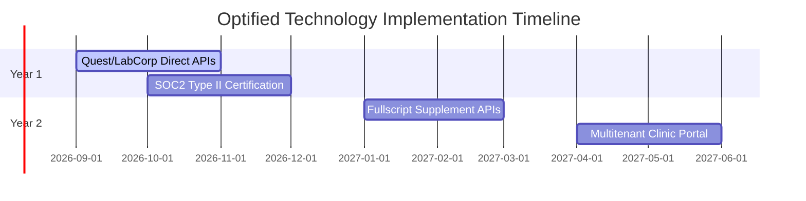

# Optified Platform: Technology & Development Roadmap
*Chronicles of Completed Phases & Add-On Feature Targets*

---

## 1. Past Milestones (Phases 1-90)
* **Core Foundation:** Go standard library core, HTMX + Alpine dynamic frontends, PostgreSQL managed schema definitions, and secure cookie session overrides.
* **Biomarkers Parsing Engine:** Genova Diagnostics, Microbiomix, and PNOĒ lab PDF parsers converting text columns into indexed SQL records.
* **Audit Trails & Security Gates:** HMAC-SHA256 digital signatures for clinician clinical observations. Ingress webhooks with signed timestamp headers and a 5-minute leeway window.

---

## 2. Recent Milestones (Phases 91-150)
* **Biometric sleep curves:** Visual multi-stage sleep SVGs detailing REM, Deep, and Light sleep stages.
* **Continuous Glucose Monitoring (CGM):** Dynamic curves showing real-time glucose and Time-in-Range (TIR) metrics.
* **KnowsItAll Journal Weighting:** RAG searches weighted by journal impact factor and country of origin.
* **Horvath Biological Age Model:** Implemented epigenetic clock simulations correlating health improvements to bio-age progression.
* **Security Hardening:** Resolved Alpine `x-html` chat vulnerabilities and implemented MFA gates for PHI CSV downloads.
* **Integrated Booking & Billing:** Connected stub forms to real database-backed endpoints for consultation scheduling, Stripe invoicing, and knowledge graph additions.

---

## 3. Next Milestones (Q4 2026 - Q2 2027)

### 3.1 Q4 2026: Quest & LabCorp Direct API Bridges
* **Objective:** Direct API integrations to fetch patient diagnostic results, eliminating PDF uploads.
* **Security:** Secure HL7/FHIR compliance bridges and OAuth2 key rotations.

### 3.2 Q4 2026: SOC2 Type II Audit & Certification
* **Objective:** Establish formal security processes and run quarterly penetration tests.

### 3.3 Q1 2027: Automated Pharmacy Dropshipping APIs
* **Objective:** Connect clinician protocols to Thorne and Fullscript APIs, enabling automated dropship delivery.

### 3.4 Q2 2027: Multitenant Clinic Portal Scaling
* **Objective:** Support multi-tenant portals managing distinct clinic sites, custom branding, and localized databases.
