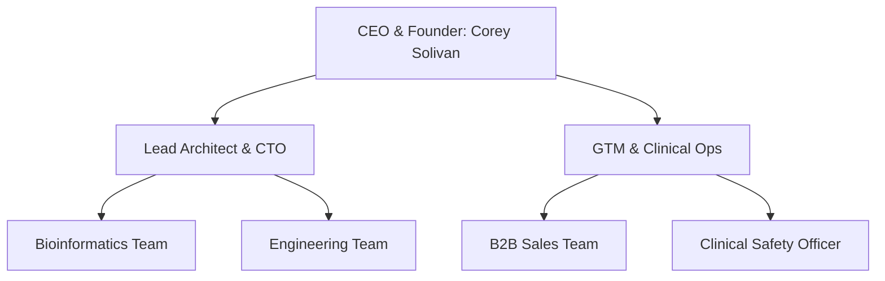

# Optified Platform: Organization & Staffing Plan
*Bio-informatics, Clinical, and Sales Scale-up*

---

## 1. Executive & Core Team Structure

Optified has a lean, technical core team that prioritizes automated infrastructure and product quality.

### 1.1 Core Positions
* **CEO & Founder (Corey Solivan):** Leads commercial strategy, direct GTM outbound clinic sales, advisory board recruitment, and financial modeling.
* **Lead Architect & CTO:** Oversees backend Go development, GKE cluster scaling, database replication, and KnowsItAll RAG core configurations.

---

## 2. Year 1 Hiring Schedule & Departments

To support growth, Optified will expand key hires across engineering, clinical operations, and B2B sales.

### 2.1 Engineering & Product
* **Bioinformatics Lead (Q3 2026):**
  * *Role:* Maintain genomic variant parsing logic and expand pipeline support for diverse lab providers.
  * *Compensation:* $160K - $190K base | 0.75% equity.
* **Senior Backend Security Engineer (Q4 2026):**
  * *Role:* Oversee HIPAA audit logs, security gates, and SOC2 compliance audits.
  * *Compensation:* $150K - $175K base | 0.5% equity.

### 2.2 Clinical Operations & Safety
* **Clinical Safety Officer (Q4 2026):**
  * *Role:* Oversee medical accuracy of KnowsItAll grounding database recommendations and supplement protocols.
  * *Compensation:* $140K - $160K base | 0.25% equity.

### 2.3 Sales & Customer Success
* **B2B Account Director (Q4 2026):**
  * *Role:* Lead outbound sales outreach targeting clinical directors at premium longevity practices.
  * *Compensation:* $110K base + commission structure (OET: $220K) | 0.5% equity.

---

## 3. Advisory & Medical Board

Optified is establishing an advisory board of longevity medical researchers and sports performance scientists to guide product strategy.
* **Clinician Advisory Partners:** Private practice directors in San Francisco and Zurich who participate in product testing.
* **Autophagy & Metabolic Researchers:** Academic researchers advising on Horvath biological age calculations and mitochondrial health baselines.
